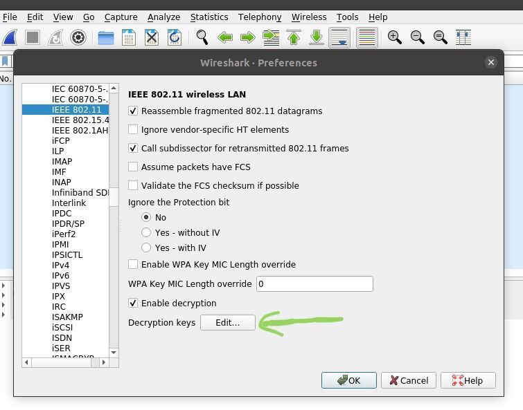
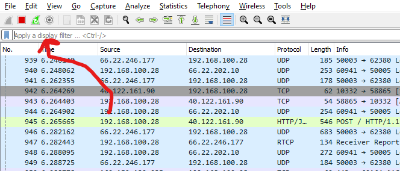

# Demonstração das vulnerabilidades do uso de senhas sem criptografia em redes sem fio usando Wireshark

 

<h3 align="center">Grupo S.i Vira</h3>

  

Somos estudantes de graduação na Universidade Federal Fluminense (UFF) e esse é um trabalho realizado na disciplina de Redes II, ministrada pelo professor Flávio Seixas.
  
<b>Objetivo:</b> Demonstrar a vulnerabilidade de segurança dos pacotes transitando dentro uma rede wireless, observando a partir do wireshark e monitorando pacotes enviados na rede.

  

<!-- DANDO INÍCIO -->
## Dando início

Para obter uma cópia local funcionando, siga esses passos de exemplo.

### Pré-requisitos e Instalação 

Ferramentas e ambiente:
<li><a href="https://ubuntu.com/download">Ubuntu</a>
<li><a href="https://www.wireshark.org/download.html">Wireshark</a>
<li><a href="https://www.google.com/chrome/">google chrome (qualquer navegador serve)</a>
<li><a href="http://testphp.vulnweb.com/login.php">site que utiliza http e simula um login</a>

<!-- EXEMPLOS DE USO -->
## Uso

Passo 1: Abrir o wireshark e selecionar a interface de rede a ser analisada. 

  

Passo 2: Configurar WPA do roteador. 

  Selecione a opção edit->preferences e dentre de preferences vamos na aba de protocolos e procurar o IEEE 802.11 wireless LAN onde acharemos uma tela como essa:
  
  

	
	Passo 2.1: Configurar WPA do roteador. 
  
	Selecione a opção para editar as description keys:
  
  

	
	Passo 2.2: Configurar WPA do roteador. 
  
	Adicione as credenciais, em seguida pressione o botão OK e o wireshark está configurado.
  

Passo 3: Monitorar os pacotes.
	
  Nesse momento o wireshark consegue enxergar pacotes transmitidos pelo wifi, que não necessariamente tem como endereço de destino ou fonte o ip do computador que esta rodando o wireshark

Inicie a captura de pacotes:

 

Passo 4: Fazendo uma requisição HTTP

	Passo 4.1: Fazendo uma requisição HTTP
  
	No computador que está rodando o wireshark*, acesse o <a href="http://testphp.vulnweb.com/login.php">site que utiliza http e simula um login</a> e simule um login com credenciais ficticias...
  
  *Uma limitação encontrada em nosso trabalho foi que não conseguimos identificar pacotes HTTP de outros dispositivos, por motivos desconhecidos.
  
   

  
	Passo 4.2: Filtragem
  
	No wireshark, utilize o filtro http para procurar por requisições http.
  
  

	Passo 4.3: Identificar a informação
  
	Procure por uma requisição que tenha a descrição como "POST" e a selecione
	na aba de conteudo do pacote terão algumas linhas, achando uma que está escrito "HTML Form URL Encoded: ..."
	ao exibir o conteudo desse header as informações ficam expostas como nessa foto:
  
  

<!-- Autoria e Contribuições -->
## Autoria

<li>Gabriel Carvalho Corrêa - gabrielcavralhocorrea@id.uff.br
<li>Diogo Valongo da Fonseca Santos - divalongo@id.uff.br
<li>Matheus de Sousa Morais - morais_matheus@id.uff.br

## Contribuindo

Contribuição é o que faz a comunidade open source um local incrível para aprender, inspirar, e criar. Qualquer contribuição que você fizer é **muito apreciada**.

